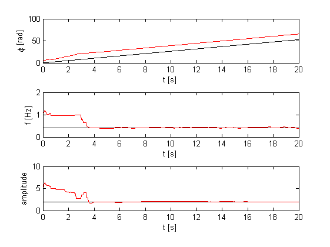

# Unscented Kalman Filter for Frequency Tracking

This example uses a constrained additive-noise scaled unscented Kalman filter in order to track a signal of the form

	y(t) = a*sin(b + 2*pi*c*T)

that is, the state vector consists of frequency, phase, amplitude and offset.

Constraints are incorporated after the transformation of the sigma points as described in *Constrained State Estimation Using the Unscented Kalman Filter* (Kandepu, Imsland and Foss, 2008).

## Performance

Performance of the filter varies from largely successful matches (shown below) to total failures, suggesting that either the observations are not enough or the process/measurement noise parameterization is sub-par.

### Signal vs. output estimate

### State vs. estimated state

